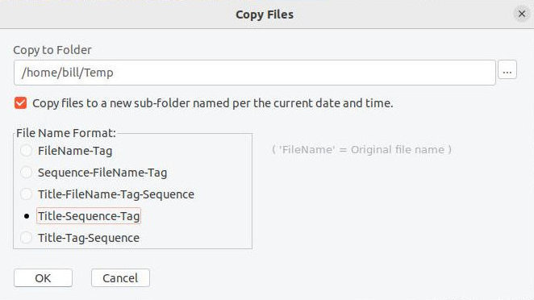

# ImagePicker

*ImagePicker* is a desktop application for selecting images and saving the list to a text file for use in other applications. It is implemented using the [Lazarus](https://www.lazarus-ide.org/) IDE for Free Pascal.

More details about the development of this application are in [devnotes](devnotes.md).

## Picking from a set of screenshots

The initial use-case for ImagePicker was to select screenshot images created by [TimeSnapper](https://www.timesnapper.com/) (mostly from an older version), or another screenshot tool, to extract specific screenshots to use in project documentation.

Picking screenshots - running on Windows. [Animation](pick-screenshots.md)

## Picking from a set of photos

ImagePicker can be used to browse and select from any set of images.

Picking photos - running on Linux (Ubuntu). [Animation](pick-photos.md)

## Scope and Limitations

As stated above, this application was created mainly to review and select from sets of screenshot images. While **ImagePicker** can be used for any set of images, it **does not rotate images**. Many image viewer/editor applications can read the [Exif](https://en.wikipedia.org/wiki/Exif) *Orientation* tag, when present in the image metadata, and automatically rotate images.

## License

The source code for the **ImagePicker** application itself is licensed using the [MIT license](LICENSE). None of the source code for Free Pascal, Lazarus, or its component libraries, was modified in any way.

The Lazarus IDE and Free Pascal compiler use versions of the GPL and LGPL licenses. However, according to the [licensing documentation](https://wiki.lazarus.freepascal.org/licensing), applications (executable binary files) produced by Lazarus are not subject to the same licensing requirements.

> The GPL does not cover any application binary created with Lazarus. The application binary itself is only limited by the components you actually link to, and in the FPC/Lazarus project those are all LGPL_with_exception. So though potentially confusing this licensing is not a problem when developing binaries with Lazarus, even if you have commercial components with designtime parts.

## Usage

### User Interface

The ImagePicker application user interface has three panels (from left to right):

- The **Current Image** panel displays the image from the open folder or the Picks list.
- The **Navigation** panel has buttons to move through a set of images.
- The **Picks** panel has the list of picked image files and other input fields, mostly related to the picks.

#### Current Image panel

- The Current Image panel has a *trackbar* at the bottom with a slider for quickly navigating to a different point in the set of images.
- *Double-clicking* on the current image adds it to the Picks list.

#### Navigation panel

The navigation panel has the following buttons:

- Toggle panel (`F4`): Collapses or expands the Picks panel to increase the display area for the current image.
- First (`Home`): Show the first image.
- Previous (`Left-arrow`): Show the previous image.
- Next (`Right-arrow`): Show the next image.
- Last (`End`): Show the last image.
- Play/Stop (`F5` or `spacebar`): Starts or stops automatically showing the next image after a defined interval.
- Picks-mode (`F2`): Toggles picks-mode.

#### Picks panel

**Title** input field: Enter an optional *Title* for the current picks.

**Speed** input field (numeric up/down): Set the interval (milliseconds) between images in slideshow-mode.

**Loop** checkbox: When checked, the image display will loop back to the first image after reaching the last image. Applies to navigation and slideshow-mode.

**Tag** input field: Enter an optional *Tag* to apply to the selected image in the picks list when the `Apply` button is clicked.

**Apply** button is sets the Tag on the selected image in the Picks list.

**Auto** checkbox: When checked, the value in the *Tag* field is automatically applied when an image is added to the Picks list.

**Picks list**: Holds the list of file names of picked images. Items in the list can be *selected* to have a tag applied, moved up or down, or removed from the list.

**Add** button: Adds the current image to the picks list.

**Remove** button: Removes the selected pick from the list.

**Show** button: Show the selected pick in the Current Image panel. The `<` (previous pick) and `>` (next pick) buttons navigate within the picks list, showing the selected image.

**Copy** button: Copies the list of picked file names (full path) to the system *clipboard* for pasting elsewhere.

**Up** button: Moves the selected pick up in the list.

**Down** button: Moves the selected pick down in the list.

### Modes

**Slideshow-mode** automatically displays the next image after a defined interval (*speed* setting).

**Picks-mode** makes it easier to focus on the picks list for selecting, tagging, reordering, and removing items.

- Disables navigation within the open images folder.
- Reassigns some navigation functions to work only within the picks list.

### Menus

#### File

##### File / Open file

Use the file-open dialog to select a file. Other image files in the same folder will be in the set of images to navigate and pick from. The file that was opened will be the current image displayed.

##### File / Open folder

Use the folder-open dialog to select a folder. All image files in the folder will be in the set of images to navigate and pick from.

##### File / Load List

Load a previously saved list of picked images. Provided the folder where the images were picked from is accessible, the images will be displayed.

##### File / Save List

Save the current list of picked images to a file. The file is a text file that can be loaded into the application later. It also is in a format that can be used to create a script to do operations with the list of images using some other tool.

##### File / Current Folder

Open the folder than contains the current image.

##### File / Exit

Exit the ImagePicker application.

#### Tools

##### Tools / Options

Open the **folder** containing the file `ImagePicker-Options.txt`. The options file is a text file containing saved settings as key-value pairs.

##### Tools / Copy files

Open the **Copy Files** dialog.

The following options are available for copying the picked image files:

**Copy to Folder** - Enter or browse for the destination folder.

To have the files copied to a new sub-folder under the selected destination, check the box for *Copy files to a new sub-folder named per the current date and time.*

There are five **File Name Format:** options:

- `FileName-Tag`
- `Sequence-FileName-Tag`
- `Title-FileName-Tag-Sequence`
- `Title-Sequence-Tag`
- `Title-Tag-Sequence`

The file naming components are as follows:

`FileName` is the original file name of the image.

`Sequence` comes from the order of the images in the *Picks* list.

`Tag` comes from the optional *Tag* as applied to individual images in the *Picks* list.

`Title` comes from the value in the *Title* text box.

##### Tools / Sort picks

Sort the file names in the Picks list.

#### Help

##### Help / Online docs

Open the URL for this README file using the default web browser.

##### Help / About

Display the *About* dialog box. 

### Keyboard commands

In the following table...

- **image** refers to an image file in the open folder, displayed in the main window.
- **pick** refers to a file name in the list box in the right panel.

Key | Default-mode | Picks-mode
----|--------------|-----------
`Home` | Display first image | Select first pick
`End` | Display last image | Select last pick
`Left-arrow` | Display the previous image | Select previous pick
`Right-arrow` | Display the next image | Select next pick
`Up-arrow` | n/a | Select previous pick
`Down-arrow` | n/a | Select next pick
`F2` | Toggle picks-mode | (same)
`F4` | Toggle picks panel | (same)
`F5` `spacebar` | Toggle Play/Stop (slideshow) | n/a
`F6` | Show selected pick | (same)
`F7` | Show previous pick | (same)
`F8` | Show next pick | (same)
`Ctrl`+`Left-arrow` | Display the previous image | n/a
`Ctrl`+`Right-arrow` | Display the next image | n/a

### Buttons (Picks panel)

Button | Key | Default-mode | Picks-mode
-------|-----|--------------|-----------
`Apply` | | Apply the text in the *Tag* field to the selected pick | (same)
`Add` | `Alt`+`A` | Add image to picks | n/a
`Remove` | `Alt`+`R` | Remove selected pick from list | (same)
`Show` | `F6` | Show selected pick | (same)
`<` | `F7` | Show previous pick | (same)
`>` | `F8` | Show next pick | (same)
`Copy` | `Alt`+`p` | Copy list of picks (file names) to clipboard | (same)
`Up` | `Ctrl`+`Up-arrow` | Move selected pick up | (same)
`Down` | `Ctrl`+`Down-arrow` | Move selected pick down | (same)

---
