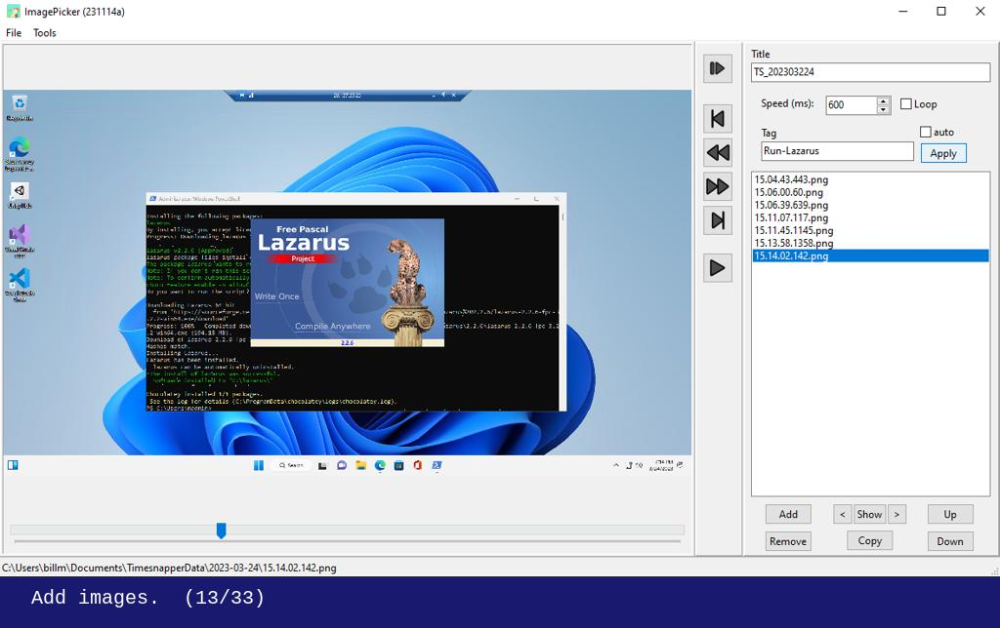
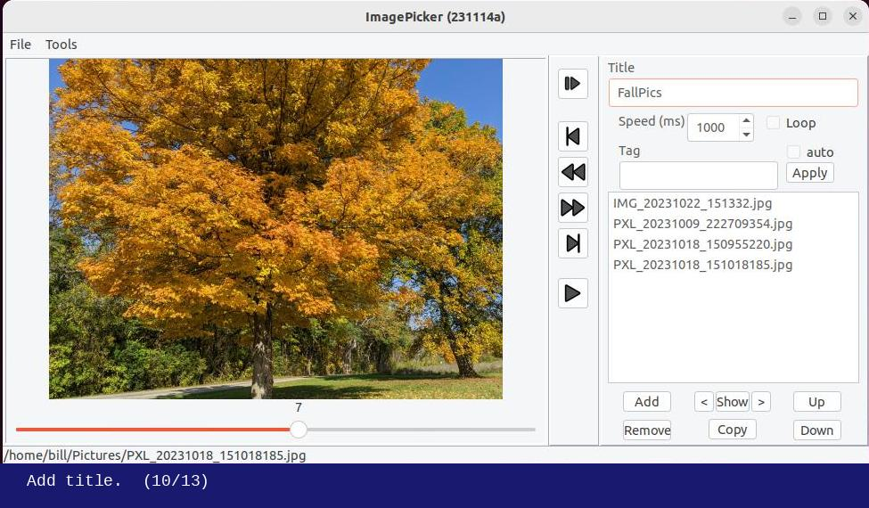

# ImagePicker

*ImagePicker* is a desktop application for selecting images and saving the list to a text file for use in other applications. It is implemented using the [Lazarus](https://www.lazarus-ide.org/) IDE for Free Pascal.

**This project is still in development. There are currently no published executable releases.**

More details about developing the application are in [devnotes](devnotes.md).

## Picking from a set of screenshots

The initial use-case for ImagePicker was to select screenshot images created by [TimeSnapper](https://www.timesnapper.com/) (mostly from an older version), or another screenshot tool, to extract specific screenshots to use in project documentation.

Picking screenshots - running on Windows. [Animation](pick-screenshots.md)

## Picking from a set of photos

ImagePicker can be used to browse and select from any set of images. 

Picking photos - running on Linux (Ubuntu). [Animation](pick-photos.md)

## Scope and Limitations

As stated above, this application was created mainly to review and select from sets of screenshot images. While **ImagePicker** can be used for any set of images, it **does not rotate images**. Many image viewer applcations can read the [Exif](https://en.wikipedia.org/wiki/Exif) *Orientation* tag, when present in the image metadata, and automatically rotate images.

## License

The source code for the **ImagePicker** application itself is licensed using the [MIT license](LICENSE).

The Lazarus IDE and Free Pascal compiler use versions of the GPL and LGPL licenses. However, according to the [licensing documentation](https://wiki.lazarus.freepascal.org/licensing), executables produced by Lazarus are not subject to the same licensing requirements.

> The GPL does not cover any application binary created with Lazarus. The application binary itself is only limited by the components you actually link to, and in the FPC/Lazarus project those are all LGPL_with_exception. So though potentially confusing this licensing is not a problem when developing binaries with Lazarus, even if you have commercial components with designtime parts.
